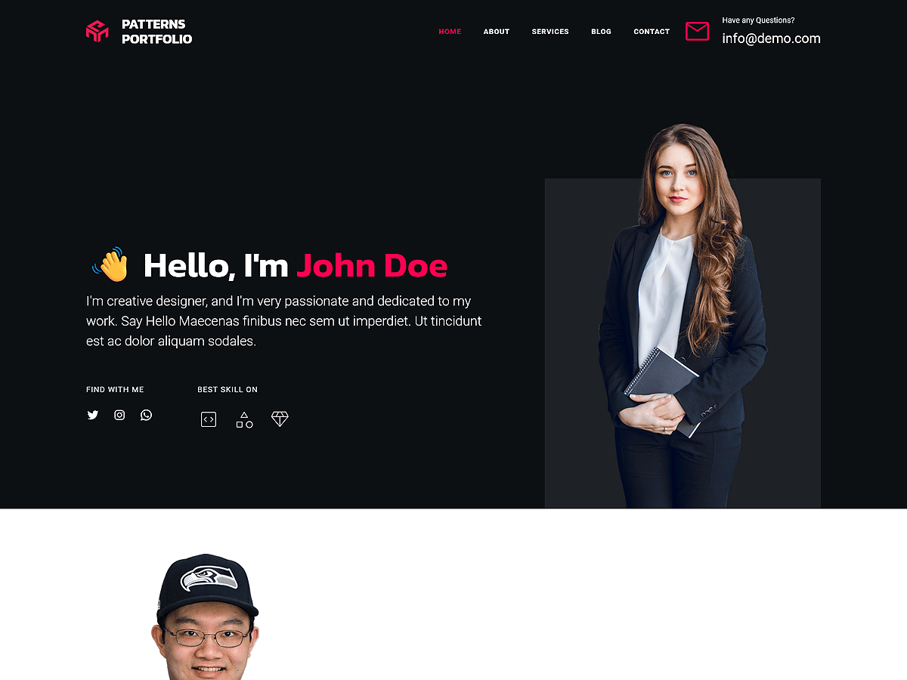

# Patterns Portfolio

Patterns Portfolio is a clean and modern WordPress theme designed for designers, photographers, artists, and creative professionals. Built with WordPress Full Site Editing (FSE), this theme allows seamless customization of headers, footers, templates, and global styles directly within the WordPress Site Editor. The theme includes pre-designed patterns and layouts crafted for showcasing creative projects, case studies, client testimonials, portfolios, and contact information. Includes layouts for highlighting featured work, services, about pages, pricing, galleries, portfolios, team members, testimonials, contact forms, and more. Its responsive design ensures your website looks polished and professional on all devices, offering a powerful platform to present your work and connect with potential clients.

Primary color: `#ff014f`.



## Features

- 3 hero and landing patterns
- 6 card layouts (card-1 through card-6)
- 1 service section pattern
- 5 archive/post-listing patterns
- Contact page pattern (page-contact)
- 1 menu navigation pattern
- 13 section layout patterns (featured sections and section titles)
- Full Site Editing (FSE) support
- Responsive design
- 66 block patterns + 15 templates + 11 template parts
- Portfolio-oriented layouts (case studies, galleries, contact)

## Requirements

- WordPress 6.6 or higher
- PHP 7.0 or higher
- Tested up to WordPress 6.7

## Development

This theme uses `@wordpress/scripts`:

```sh
npm install
npm run start    # dev mode with watch
npm run build    # production build
```

## License

GNU General Public License v2 or later.

This theme is based on [WP Block Theme Boilerplate](https://github.com/codersantosh/wp-block-theme-boilerplate), (C) 2025 Santosh Kunwar, [GPLv2 or later](https://www.gnu.org/licenses/gpl-2.0.html).
